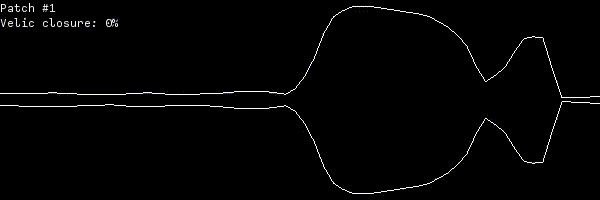

# Nanceloid

a vocal synth using digital waveguides n stuff lol

work in progressssssss~~~~~~~~~~
probably broken maybe




## Dependencies

In order to build and run the standalone synth you will need [SFML](https://sfml-dev.org) and [RtMidi](https://github.com/thestk/rtmidi).

In order to build the VST plugins you will need the following:
- `i686-w64-mingw32-g++`
- `x86_64-w64-mingw32-g++`
- the VST SDK 2.4

Obtain the VST SDK 2.4 and place the contents at the root of this repository in `vstsdk2.4`.
When placed correctly it should look like this:
```bash
$ ls vstsdk2.4/
artwork  bin  doc  index.html  pluginterfaces  public.sdk  vstgui.sf
```

## How to build

Run `make synth` to produce the `build` directory containing the following:
- `nanceloid` is the standalone synth.

Run `make vst` to produce the `build` directory containing the following:
- `nanceloid32.dll` is the 32-bit version of the VST plugin.
- `nanceloid64.dll` is the 64-bit version of the VST plugin.

Run `make clean` to remove the `build` directory and its contents after it has been created.

## How to run

Run `make run` to run the standalone synth.

Load `build/nanceloid32.dll` or `build/nanceloid64.dll` into your DAW or VST host to use the VST plugin.

## How to use

_TODO: explain n stuff lol_

## Immediate todo list

- patch saving
- turbulence
- improve vocal folds...
- improve pitch correction
- get vst working again
- reverb
- junction resolution parameter to optimize for very long waveguides ?? maybe
